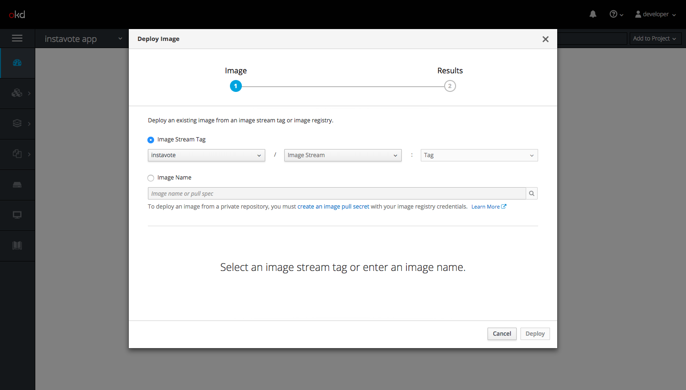
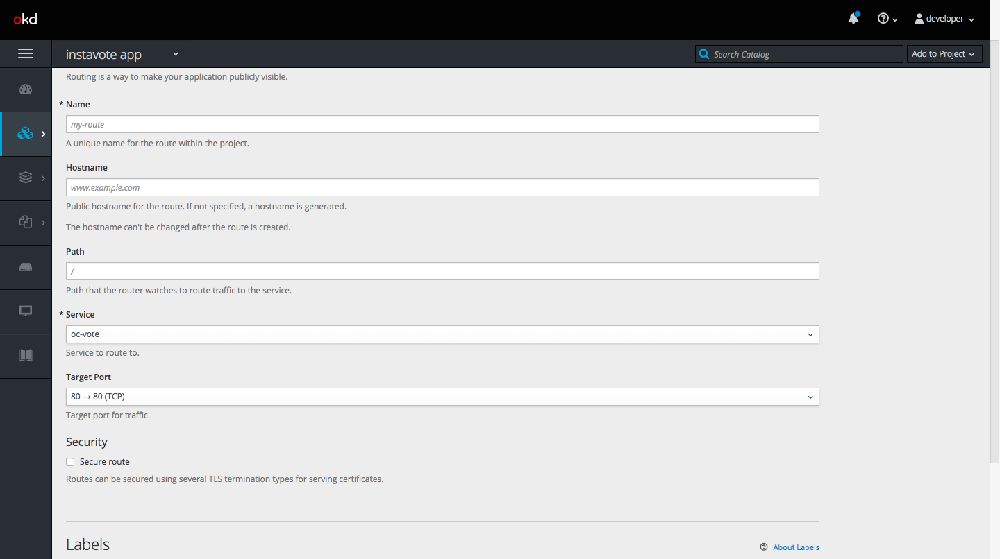
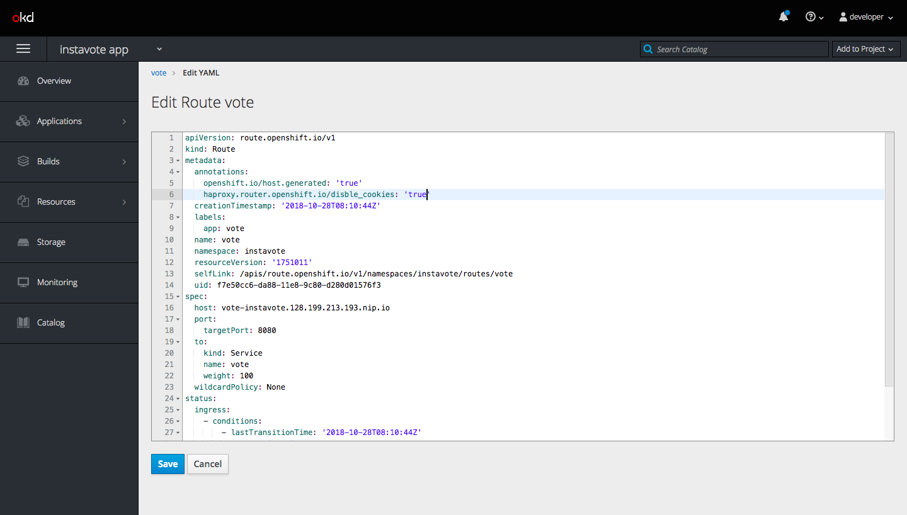

### Deploying Vote and Redis with Images - Images, Image Streams, Router Configs

In this section we are talking about deploying the vote app with database redis using already build images. We are also talking about image Streams and Router config in the openshift.

#### Setting openshift on a remote Fedora server

in this section we are talking about how to set up openshift environment in  fedora operating system

##### System Requirements
 * Physical or virtual system, or an instance running on a public or private IaaS.

* Base OS
* Docker
* 2 vCPU
* Minimum 8 GB RAM
* Minimum 15 GB hard disk space
* An additional minimum 15 GB unallocated space to be configured using docker-storage-setup

use this link for [installation](https://github.com/openshift/origin/blob/master/docs/cluster_up_down.md#linux) documents.

In this case we need to install docker use the following script for docker installation for fedora.

```
#!/bin/bash

sudo dnf remove -y docker \
                  docker-client \
                  docker-client-latest \
                  docker-common \
                  docker-latest \
                  docker-latest-logrotate \
                  docker-logrotate \
                  docker-selinux \
                  docker-engine-selinux \
                  docker-engine

sudo dnf -y install dnf-plugins-core
sudo dnf config-manager \
    --add-repo \
    https://download.docker.com/linux/fedora/docker-ce.repo
sudo dnf install -y docker-ce
sudo systemctl start docker

I: "Validating dokcer installation..."
sudo docker run hello-world

```

edit the /etc/docker/daemon.json file and add the following

```
cat > /ete/docker/daemon.json
{
   "insecure-registries": [
     "172.30.0.0/16"
   ]
}
```

After editing the config, reload systemd and restart the Docker daemon.

```
sudo systemctl daemon-reload
sudo systemctl restart docker
```
Determine the Docker bridge network container subnet:
```
docker network inspect -f "{{range .IPAM.Config }}{{ .Subnet }}{{end}}" bridge

```

then download the [openshift](https://github.com/openshift/origin/releases)

```
wget -c https://github.com/openshift/origin/releases/download/v3.10.0/openshift-origin-client-tools-v3.10.0-dd10d17-linux-64bit.tar.gz
```
```
tar -xvf openshift-origin-client-tools-v3.10.0-dd10d17-linux-64bit.tar.gz
cd openshift-origin-client-tools-v3.10.0-dd10d17-linux-64bit/

mv oc /usr/local/bin/
```
```
which oc
```
[output]

```
/usr/local/bin/oc
```

```
oc cluster up --public-hostname=[host_ip]
```

#### Deploying with image

In this section we are talking about deploying app using existing image. just check the openshift status.
```
oc ststus
```
[output]

```
In project demo on server https://128.199.213.193:8443

http://demoapp-demo.128.199.213.193.nip.io to pod port 8080-tcp (svc/demoapp)
  dc/demoapp deploys istag/demoapp:latest <-
    bc/demoapp source builds https://github.com/devopsdemoapps/devops-demo-app.git#master on openshift/php:7.1
    deployment #2 deployed 2 days ago - 5 pods
    deployment #1 deployed 2 days ago

svc/mariadb - 172.30.193.105:3306
  dc/mariadb deploys openshift/mysql:5.7
    deployment #1 failed 2 days ago: config change


3 infos identified, use 'oc status -v' to see details.
```
create the project using  following command.

```
oc new-project instavote --display-name="instavote app" --description="Sample voting application"
```
[output]
```
Now using project "instavote" on server "https://128.199.213.193:8443".

You can add applications to this project with the 'new-app' command. For example, try:

    oc new-app centos/ruby-22-centos7~https://github.com/openshift/ruby-ex.git

to build a new example application in Ruby.
```
then check the projects.

```
oc get projects
```
[output]

```
NAME        DISPLAY NAME    STATUS
demo        demo            Active
instavote   instavote app   Active
myproject   My Project      Active
```
deploy the vote application using existing image form docker hub registries.

```
initcron/oc-vote:v1
```

click on your created project instavote then click on overview and click on deploy with image. provide some information on this page



here , Provide name, environment variables and labels.
then click on deploy.


#### Exposing vote app with Router
 In this section we are talking about how to expose application with router.
  just check pods, replicas and deployment config.

```
oc get pods,rc,dc

```
[output]

```
NAME                  READY     STATUS    RESTARTS   AGE
pod/oc-vote-2-7ckd5   1/1       Running   0          32s
pod/oc-vote-2-jwp45   1/1       Running   0          9m
pod/oc-vote-2-qkdrc   1/1       Running   0          33s
pod/oc-vote-2-rlp25   1/1       Running   0          32s

NAME                              DESIRED   CURRENT   READY     AGE
replicationcontroller/oc-vote-1   0         0         0         10m
replicationcontroller/oc-vote-2   4         4         4         9m

NAME                                         REVISION   DESIRED   CURRENT   TRIGGERED BY
deploymentconfig.apps.openshift.io/oc-vote   2          4         4         config,image(oc-vote:v1)
```
```
oc get svc
```
[output]
```
NAME      TYPE        CLUSTER-IP     EXTERNAL-IP   PORT(S)           AGE
oc-vote   ClusterIP   172.30.206.1   <none>        80/TCP,8080/TCP   12m
```
get endpoints using following command.

```
oc get endpoints
```
[output]

```
NAME      ENDPOINTS                                                  AGE
oc-vote   172.17.0.11:80,172.17.0.12:80,172.17.0.13:80 + 5 more...   14m
```

get image stream using following command.

```
oc get is
```
[output]
```
NAME      DOCKER REPO                         TAGS      UPDATED
oc-vote   172.30.1.1:5000/instavote/oc-vote   v1        16 minutes ago
```
```
oc describe is/oc-vote
Name:			oc-vote
Namespace:		instavote
Created:		17 minutes ago
Labels:			app=oc-vote
			role=vote
Annotations:		openshift.io/image.dockerRepositoryCheck=2018-10-28T07:12:40Z
Docker Pull Spec:	172.30.1.1:5000/instavote/oc-vote
Image Lookup:		local=false
Unique Images:		1
Tags:			1

v1
  tagged from initcron/oc-vote:v1

  * initcron/oc-vote@sha256:b05f64d225a8671ecc09d22760a2c76bd65aaf50e12d00b31ab3b4fe6f377b06
      17 minutes ago
```
go to your openshift UI and click on application->routes.



fill all the information


#### Introduction to oc new-app command
In this section we are talking about to oc new-app command.

```
oc get all -l app=oc-vote
```
[output]
```
NAME                  READY     STATUS    RESTARTS   AGE
pod/oc-vote-2-7ckd5   1/1       Running   0          24m
pod/oc-vote-2-jwp45   1/1       Running   0          33m
pod/oc-vote-2-qkdrc   1/1       Running   0          24m
pod/oc-vote-2-rlp25   1/1       Running   0          24m

NAME                              DESIRED   CURRENT   READY     AGE
replicationcontroller/oc-vote-1   0         0         0         34m
replicationcontroller/oc-vote-2   4         4         4         33m

NAME              TYPE        CLUSTER-IP     EXTERNAL-IP   PORT(S)           AGE
service/oc-vote   ClusterIP   172.30.206.1   <none>        80/TCP,8080/TCP   34m

NAME                                         REVISION   DESIRED   CURRENT   TRIGGERED BY
deploymentconfig.apps.openshift.io/oc-vote   2          4         4         config,image(oc-vote:v1)

NAME                                     DOCKER REPO                         TAGS      UPDATED
imagestream.image.openshift.io/oc-vote   172.30.1.1:5000/instavote/oc-vote   v1        34 minutes ago

NAME                               HOST/PORT                                  PATH      SERVICES   PORT       TERMINATION     WILDCARD
route.route.openshift.io/oc-vote   oc-vote-instavote.128.199.213.193.nip.io             oc-vote    8080-tcp   edge/Redirect   None
```
```
oc delete all -l app=oc-vote
```
[output]

```
pod "oc-vote-2-7ckd5" deleted
pod "oc-vote-2-jwp45" deleted
pod "oc-vote-2-qkdrc" deleted
pod "oc-vote-2-rlp25" deleted
replicationcontroller "oc-vote-1" deleted
replicationcontroller "oc-vote-2" deleted
service "oc-vote" deleted
deploymentconfig.apps.openshift.io "oc-vote" deleted
imagestream.image.openshift.io "oc-vote" deleted
route.route.openshift.io "oc-vote" deleted
```

```
oc new-app --list
```

search template

```
oc new-app --search --template=ruby --output=yaml
```
[output]

```
apiVersion: v1
items: []
kind: List
metadata: {}
```
#### Setup vote app with using oc cli utility

In this section we are redeploying vote application using oc cli.

```
oc new-app --docker-image=initcron/oc-vote:v1 --name=vote
```
[output]
```
--> Found Docker image c97dc33 (2 months old) from Docker Hub for "initcron/oc-vote:v1"

    * An image stream will be created as "vote:v1" that will track this image
    * This image will be deployed in deployment config "vote"
    * Ports 80/tcp, 8080/tcp will be load balanced by service "vote"
      * Other containers can access this service through the hostname "vote"

--> Creating resources ...
    imagestream "vote" created
    deploymentconfig "vote" created
    service "vote" created
--> Success
    Application is not exposed. You can expose services to the outside world by executing one or more of the commands below:
     'oc expose svc/vote'
    Run 'oc status' to view your app.
```
```
oc status
```
[output]
```
In project instavote app (instavote) on server https://128.199.213.193:8443

svc/vote - 172.30.83.46 ports 80, 8080
  dc/vote deploys istag/vote:v1
    deployment #1 deployed about a minute ago - 1 pod


2 infos identified, use 'oc status -v' to see details.
```

```
oc expose svc/vote
```
[output]

```
route "vote" exposed
```
```
oc status
```
[output]
```
In project instavote app (instavote) on server https://128.199.213.193:8443

http://vote-instavote.128.199.213.193.nip.io to pod port 80-tcp (svc/vote)
  dc/vote deploys istag/vote:v1
    deployment #1 deployed 6 minutes ago - 1 pod


2 infos identified, use 'oc status -v' to see details.
```
```
oc get routes
```
[output]
```
NAME      HOST/PORT                               PATH      SERVICES   PORT      TERMINATION   WILDCARD
vote      vote-instavote.128.199.213.193.nip.io             vote       80-tcp                  None
```

```
oc delete route/vote
```
[output]
```
route.route.openshift.io "vote" deleted
```
```
oc get svc
```
[output]
```
NAME      TYPE        CLUSTER-IP     EXTERNAL-IP   PORT(S)           AGE
vote      ClusterIP   172.30.83.46   <none>        80/TCP,8080/TCP   11m
```

```
oc expose service vote --port=8080
```
[output]
```
route "vote" exposed
```
#### Using annotations to change Router configurations

In this section we are talking about how to change Router configurations.  

```
oc scale --replicas=4 dc/vote
```
[output]
```
deploymentconfig.apps.openshift.io "vote" scaled
```
we need to edit 

add following line

```
haproxy.router.openshift.io/disble_cookies: 'true'
```
#### Deploying Redis and connecting it woth the vote frontend
 In this section we are talking about database connectivity of our vote frontend application. We have already deployed voted application. we will connect the database that application. we will use redis as backend.

use the following command to redis deployment.

```
oc new-app --name redis --docker-image=redis:alpine
```
[output]
```
--> Found Docker image 05635ee (9 days old) from Docker Hub for "redis:alpine"

    * An image stream will be created as "redis:alpine" that will track this image
    * This image will be deployed in deployment config "redis"
    * Port 6379/tcp will be load balanced by service "redis"
      * Other containers can access this service through the hostname "redis"
    * This image declares volumes and will default to use non-persistent, host-local storage.
      You can add persistent volumes later by running 'volume dc/redis --add ...'
    * WARNING: Image "redis:alpine" runs as the 'root' user which may not be permitted by your cluster administrator

--> Creating resources ...
    imagestream "redis" created
    deploymentconfig "redis" created
    service "redis" created
--> Success
    Application is not exposed. You can expose services to the outside world by executing one or more of the commands below:
     'oc expose svc/redis'
    Run 'oc status' to view your app.
```

#### Update environment vars and images with oc set
In this section we talking about how update environment variables using oc cli. We have already deployed vote application we will change env for vote application. we use the following command for that.

```
oc set env dc/vote OPTION_A=myoption
```
[output]
```
deploymentconfig "vote" updated
```
```
oc get is
oc get istag
```

update version of application.

```
oc set image dc/vote vote=initcron/oc-vote:v2
```
[output]
```
deploymentconfig "vote" image updated
```
